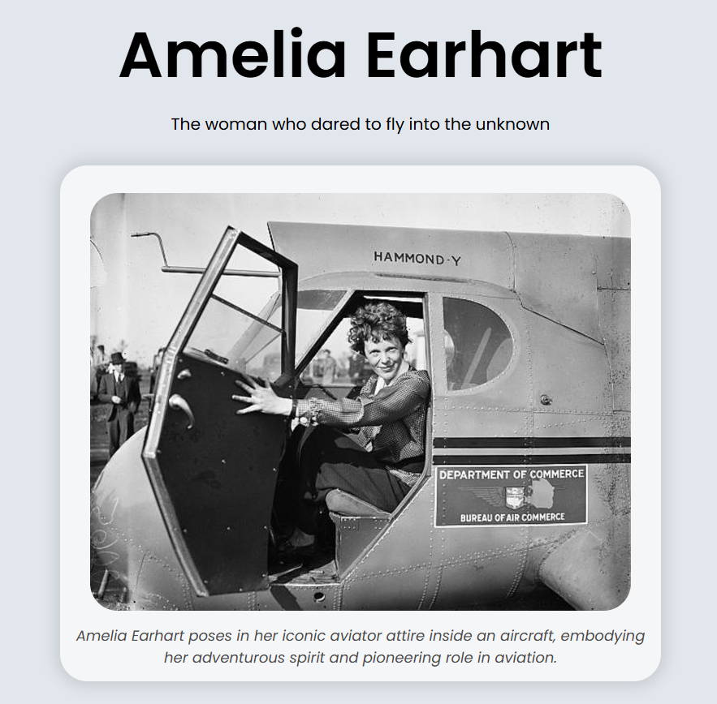
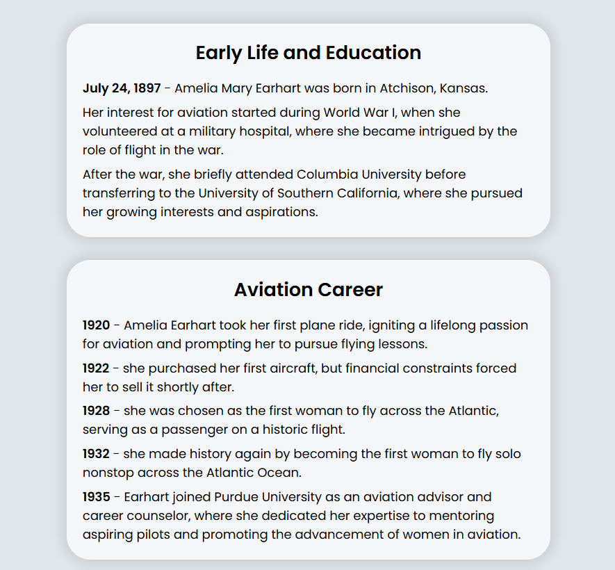
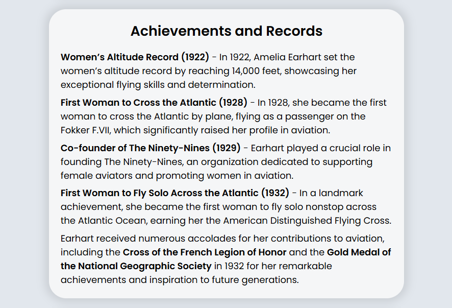
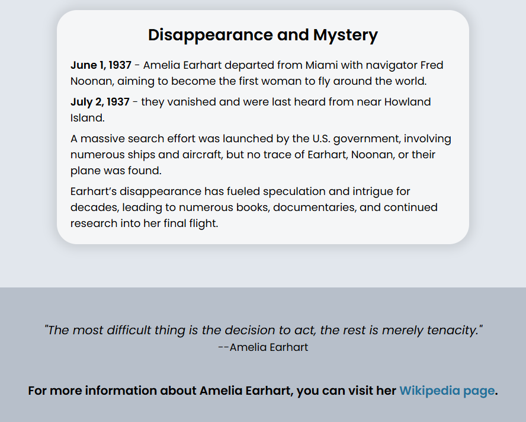

# Tribute Page

A responsive tribute page created independently using HTML and CSS, following guidelines from the FreeCodeCamp Responsive Web Design certification course.

## Description

This project showcases a tribute to Amelia Earhart, providing information about her early life, aviation career, achievements, and mysterious disappearance. The page is designed to be clean, modern, and fully responsive, meaning it adjusts seamlessly to different screen sizes, from desktop to mobile devices. The layout is structured with a focus on readability and visual appeal, using CSS Flexbox and other modern styling techniques. Created as part of the FreeCodeCamp curriculum, I completed this project by following specific guidelines while applying my own design choices.

## Features

- Responsive design that adapts to different screen sizes.
- Flexbox layout for easy readability and consistent structure.
- Stylish image presentation with object-fit and border-radius for a modern look.
- Structured content divided into sections
- Box-shadow and border-radius effects for a clean, polished design.
- Centered, well-aligned content for a cohesive and balanced layout.

## Technologies Used

- HTML
- CSS

## How to Run

1. Clone the repository to your local machine.
2. Open `index.html` in your web browser.

## Acknowledgments

This project was completed as part of the FreeCodeCamp Responsive Web Design certification course. Special thanks to FreeCodeCamp for providing the resources and guidance.
